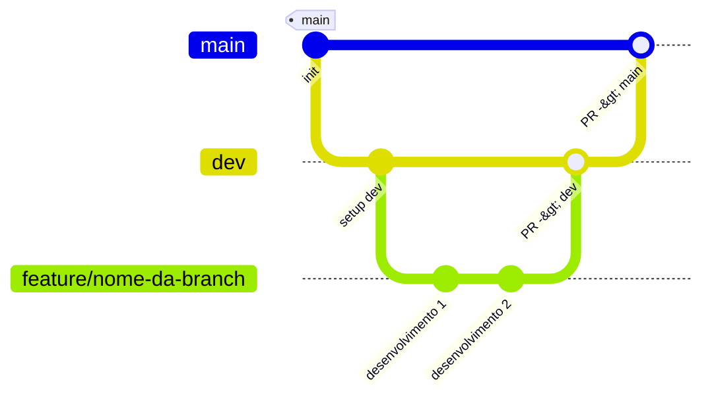
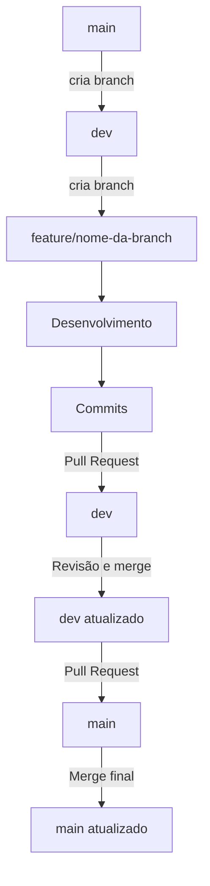

# CONTRIBUTING.MD

Segue o fluxo atual de desenvolvimento: 





## Contribuição

Siga os passos abaixo para contribuir com o repositório.

`clonar repositório → criar branch → desenvolver e commitar → fazer push → abrir pull request`

### Atualizar seu repositório local

Antes de desenvolver, sempre atualize seu repositório com as últimas mudanças

```
git fetch

git pull
```

### Criar uma branch

Para trabalhar numa nova tarefa, crie uma branch específica (sempre derivada de `dev`)

```
git branch

git checkout -b nome-branch-local
```

### Salvar alterações no local

```
git status

git add nome-do-arquivo | git add .

git commit -m "mensagem-do-commit"
```

### Salvar alterações no remoto

O comando abaixo cria uma branch no github e conecta ela à sua branch atual

```
git push -u origin nome-da-branch
```

### Abrir Pull Request

Entre no github e abra uma PR, pedindo avaliação e `merge` da sua branch para a `dev`